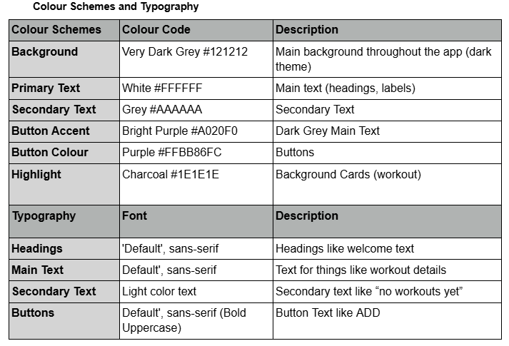

# Habit Tracker App

## BC.D3
Demonstrate individual responsibility, creativity and effective self-management in the design, development and review of a mobile app.

---

## Habit Tracker App | Timetable 10 Weeks

---

## B.P3
Produce designs for a mobile app to meet identified requirements.

### Requirements

To produce the required documentation we must first look at the requirements requested by the client in order to produce the best possible documentation and product. The following documents were created following the clients requirements in order to cover them which were.

- To track the amount of water someone has drunk in a day
- To track the number of workouts
- To have a timer that can be used during workouts

As such the following documentation was created

### Design Documentation - Pre Review

#### Wireframe

Has a welcome screen with a welcome message and 4 icons to switch between parts of the app, the water section allows you to increase and decrease the amount of water with text and an icon to show you and help keep track. The workout timer section allows you to start and stop a timer for use with workouts and finally the workout section allows you to add a workout to keep track of the number of workouts

#### User Flow

---

## Colour Schemes and Typography

---

## B.M2
Justify how decisions made during the design process ensure the design for the app will meet identified requirements.

### Wireframe
Looking at the wireframe you can see that the app is quite simple and easy to use, it has a simple welcome screen and then the water section consists of 2 buttons. The timer then has a start and stop with good sized readable text for when people are sweaty and working hard in the gym making it easier to read and finally the workout section is one button making it very easy and simple to use, i can justify that through the fact that when people are hot and working hard at the gym the last thing they want would be an app that's over complicated.
### User Flow
The user flow diagram was created using figma to show how a user is able to navigate the app, looking at the user flow you can see that there is a home section that connects to all of the other sections of the app. Because of this the user can navigate through the app seamlessly and smoothly, this is important for an app like this that people will be using at a gym where they will be hot, sweaty and tired. That is how I can happily justify the decisions made, as the options meet the clients requirements but also allow users to find the app easy to use in the scenario that they will be using it.

The choices I made came after doing some research and looking at apps. Most users prefer apps with a dark theme as it's easier on the eyes which can help in a bright gym or when a user has been working out. It also helps the app look modern and sleek which will help users want to use the app

I believe that the grey, black, white and purple provide good contrast for users which helps with accessibility but also making it easier to read if a user is tired and working out, they dont need to strain their eyes as much

For typography I went for the default text that android provides, this is because i believe that the text is easy to read and also cuts down on the complexity of building the application while still keeping the accessibility and easy readability of the app. Making the app simple, yet modern and therefore very easy to read when a user is working hard at the gym.

To conclude the decision i have made in the design process will not only meet the clients need but also the users needs and is fit for purpose, it provides simplicity and ease of use so to user can download the app at anytime and use it without needing to figure out what does what as everything is easy to understand and clearly labelled.

I Also believe that by coming up with the colours, themes, and design that this shows individual responsibility, creativity and effective self-management in the design, development and review of a mobile app.

---

## B.P4
Review the mobile app designs with others to identify and inform refinements.

As part of the project it's important to review the documentation with the client in order to ensure that the product will meet the clients requirements, expectations and preferences. Because of this i emailed Simon Adams, Project manager at Shweaty Gym

Here you can see the email correspondence I sent which shows professional language while also being polite, explaining why the review is needed and in a clear easy to understand and professional request and also to ensure that I am demonstrating individual responsibility and effective self management.

Here you can see the reply said that they would like 3 things, 1 for the app to have a reset button for the water to make it easier for the user to reset the counter, 2 for the app to have a way to restart the timer, which i something i overlooked and thirdly although it isnt a requirement they would like a way for the user to be able to manually select a workout in order to help keep track of not just workouts but what workouts.

Here you can see the response, i made the client aware i made the changes and apologised for missing the reset on the timer, it was a very professional message done in a timely manner and shows that I am demonstrating individual responsibility and effective self management.

---

### Optimised Design Documentation Post Review

## Wireframe

## Userflow

## C.P5
Produce a mobile app that meets the design criteria.

Home Screen that welcomes people to the app

Water app that allows users to increase amount of water to keep track

Timer that allows users to keep track of workout

Workout section that allows users to add a work out and enter the name and the duration they will do it for
---

## C.P6 Test a mobile app for functionality, usability, stability and performance

All Testing were carried out Virtual devices for the Google Pixel 9 Pro XL, 9 Pro Fold, 7 and 4 for the highest variety in device age, type and screen size to maximise compatibility

---

## C.P7 Review the extent to which the mobile app meets the identified requirements.
To be able to review the extent to which the mobile app meets the requirements its important to know what they were in the first place. The app was created for a wellness spa and gym with the aim to help users have the ability to track their water intake, their workouts and time their exercises and the project had the aim to meet those 3 requirements to help users track their habits.
## Water Tracker
With the water tracker, users are able to increase and decrease as well as reset the number of glasses of water they have consumed, the counter won't drop below 0 and the UI updates immediately.
## Workout Tracker
Users can add the names of their workouts and the duration so they can put in custom workouts, the workouts get stored using LiveData so the user can see them, they can also edit the workouts to edit the duration or name of them, helping the workout tracker be highly flexible.
## Timer
The timer is a simple timer that lets the user start, stop and reset the time as they wish, the time gets displayed in seconds and is clear and easy to see which is important when the user is at the gym as well as being simple to use.
## Home Screen
Ths was not a requirement, however i took it upon myself to implement it, as a user of mobile apps i strongly feel that its important that an app has a home screen, something tidy and clean but that gives a user a fresh perspective and look when they first open the app, this way the user isn't bombarded with buttons or information.
## Experience and UI
I Believe that to review the application it's important to also look at the testing and the user experience, as this tells you, is the app good or just functional, because if this i will discuss both of those. The app was designed with a dark theme in mind, this was a choice on my side after research for 3 key reasons. Firstly from researching and also my personal experience, I find that a dark theme on apps, especially gym apps, feels much more modern and stylish.

Secondly, are accessibility factors, the first being the contrast options, with a darker theme/background it's much easier to have contrasting text making it easier to see and read which increases the accessibility of the app with users with visual impairments, secondly is how the dark theme helps user in the gym, who might workout in the evening, or even day, regardless of time, the gym is usually lit up and bright, this makes it easier to see the app as well as the UI being simple, very easy to use and buttons being good sizes meaning that it's easier for users with disabilities or difficulties but also easier to use while working out.
With the ui however there was an issue with one of the pages where on some models of phone the water page text gets hidden behind the header, this is a known issue discovered in testing and will be resolved when making optimisations.
## Testing
Lastly is the testing, the app was tested to make sure that all features work as intended, during functionality testing all of the required and intended features worked across multiple devices which is a big positive for compatibility of the app.

During Validation testing, all of the validations on the app worked as intended without any issues or bugs, during usability testing it was clear that the app runs smoothly and is responsive throughout different devices and screen sizes, however some tweaks will need to be made since an issue was found with the UI of the water page, this issue is currently being resolved for optimisations

Because of these reasons after review, I believe I have fully met the clients requirements and also by adding a home screen and design decisions. I also believe that this demonstrates my individual responsibility, creativity and effective self-management in the design, development and review of a mobile app.

---

## C.M3
Optimise a mobile app that meets the design criteria.

Now that I have reviewed the app, I am able to take a step back, look at it and optimise it in order to provide the client with the best possible product and exceed the client's requirements that the app already meets.

The first optimization we will make is to fix the water screen UI which as you can see currently gets covered by the top banner, and in the second image you can see the the ui was fixed and now has the correct placement.

Next i added a delete button to the workout section so users do not need to edit the workout to delete it, this makes it easier to use and users won't have to figure out that they need to delete all validation text to remove the workout

Finally I decided to change the purple to yellow to further help with the contrast and accessibility but also to make the app feel more modern. Right now I feel as if it looks more like teams in dark mode and we want a gym app. We also made the button text colour black so it can be seen and has contrast. Also gave the yellow buttons a grey effect when pressed for style.

---

## BC.D2
Evaluate the design and optimised mobile app against client requirements.

## Final Evaluation

This project was a delight to work on and really enjoyable however with that being said to have a strong evaluation its important to go back and look at the strengths and weaknesses of the app
Strengths
First let's look at the strengths

- All requirements were met and all features are built into the site

- Modern, dark themed design which has a consistent colour theme

- Responsive layout that was tested on multiple devices

- Many useful features like delete and custom workout

- Clean, modern expandable

- App is very accessible and provides features like a good contrast and ease of navigation
## Weaknesses
Now lets look at the weaknesses

- There were difficulties with spacing particularly with ui and nav bar

- I would like to add more features

- Background is a little plain, no images
## Future improvements
Finally lets look at where we can improve for next time.

- Use images to make the app look nice

- Make UI rounder and less blocky

- Force full screen so the layout looks nicer

After looking at my original work and then the changes that I made I can say with confidence that the final version of the The Habit Tracker app meets all of the clients requirements that were outlined for my project. The app has all of the features and requirements asked of the client and more, it has an easy to understand and clean layout and format, a timer thats easy to use and understand so users don't have to struggle to use it while at the gym.

There is a detailed workout section which not only allows you to keep track of workouts as required but also allows the user to add, edit and delete the workouts manually so they can customise their workout experience

Has a clean simple homepage and finally the app has a water tracker that allows users to keep track of their water intake at the click of a button making the usage of the app particularly fit for the clients target audience
